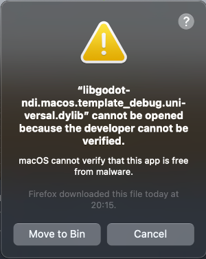
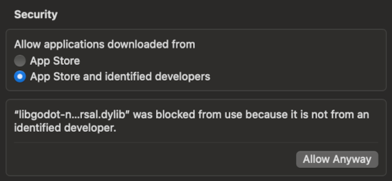
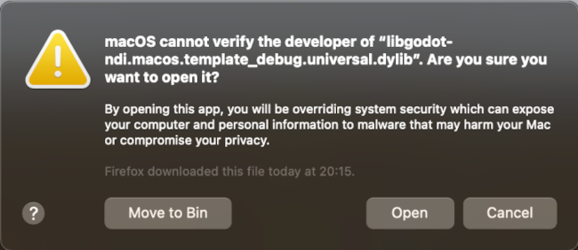

# Installing on MacOS

> Contributed by Foreman21, tested on MacOS Sonoma 14.6

Since the distributed binaries aren't signed, MacOS will refuse to load them unless you make an excpetion.
Note that when you export and sign your project for MacOS or iOS, the godot-ndi binaries will be signed too.

1. **Click cancel**
2. **Go to Settings > Privacy & Security**

3. **Click `Allow Anyway`**
3. **The first popup may appear again for a different file from Godot NDI. Click `Cancel` and `Allow Anyway` again**

4. **Then click `Open`**

