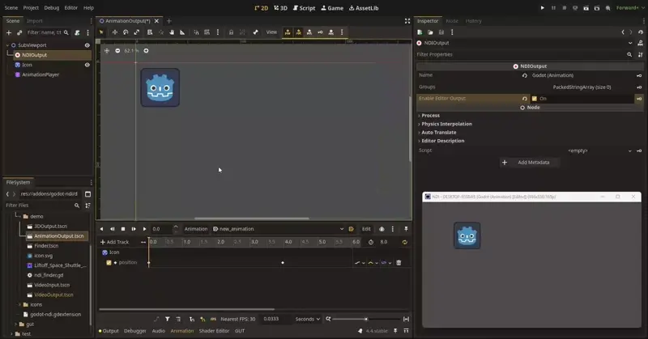
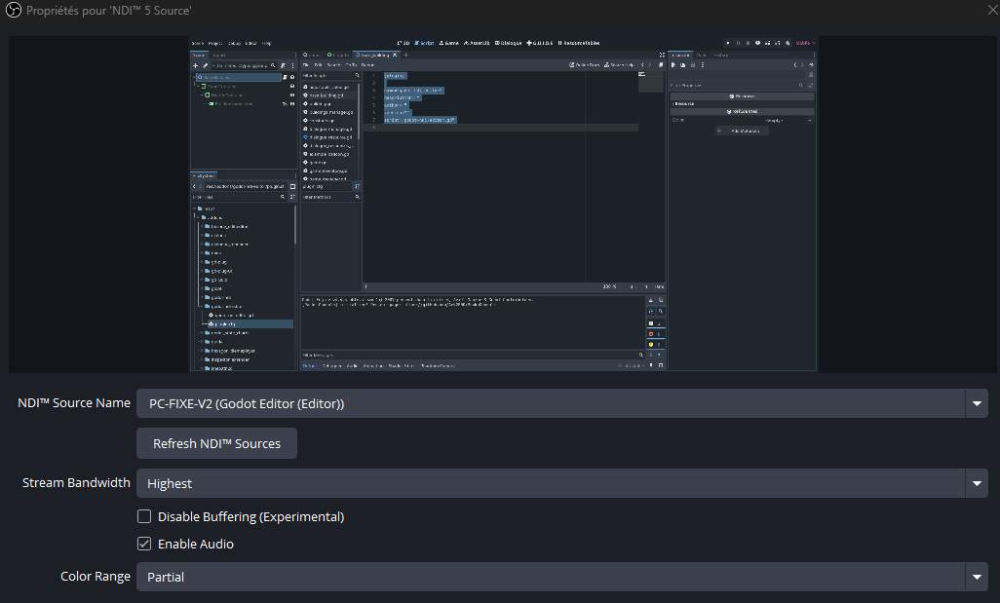

# Outputting the Editor

The [Enable Editor Output](class_NDIOutput_property_enable_editor_output) property can be used to also have [NDIOutput](class_NDIOutput) run in the Editor. There is no difference in behavior other than the source name being suffixed. This means NDIOutput will still choose the closest Viewport up the tree, which - without any SubViewports - is the Editor's 2D View.



This allows for a great deal of flexibility in extending the Editor's capabilities, while keeping parity between Editor and Runtime. However, if you are looking to transmit the actual Editor UI a different approach is needed. To accomplish this, a Editor Plugin can be created that injects the NDIOutput Node further up the internal SceneTree of the Editor.

_Contributed by Zehir_

`addons/godot-ndi-editor/godot-ndi-editor.gd`

```gdscript
@tool
extends EditorPlugin

var output: NDIOutput

func _enter_tree() -> void:
	output = NDIOutput.new()
	output.name = "Godot Editor"
	output.enable_editor_output = true
	add_child(output)

func _exit_tree() -> void:
	if is_instance_valid(output):
		output.queue_free()
```

`addons/godot-ndi-editor/plugin.cfg`

```ini
[plugin]

name="godot-ndi-editor"
description="Inject NDI Output node to Godot Editor"
author="Zehir"
version="1.0.0"
script="godot-ndi-editor.gd"
```

Here is the full Editor UI being received in OBS:



For a more in-depth solution with support for pop-ups see [GH-14](https://github.com/unvermuthet/godot-ndi/issues/14).
